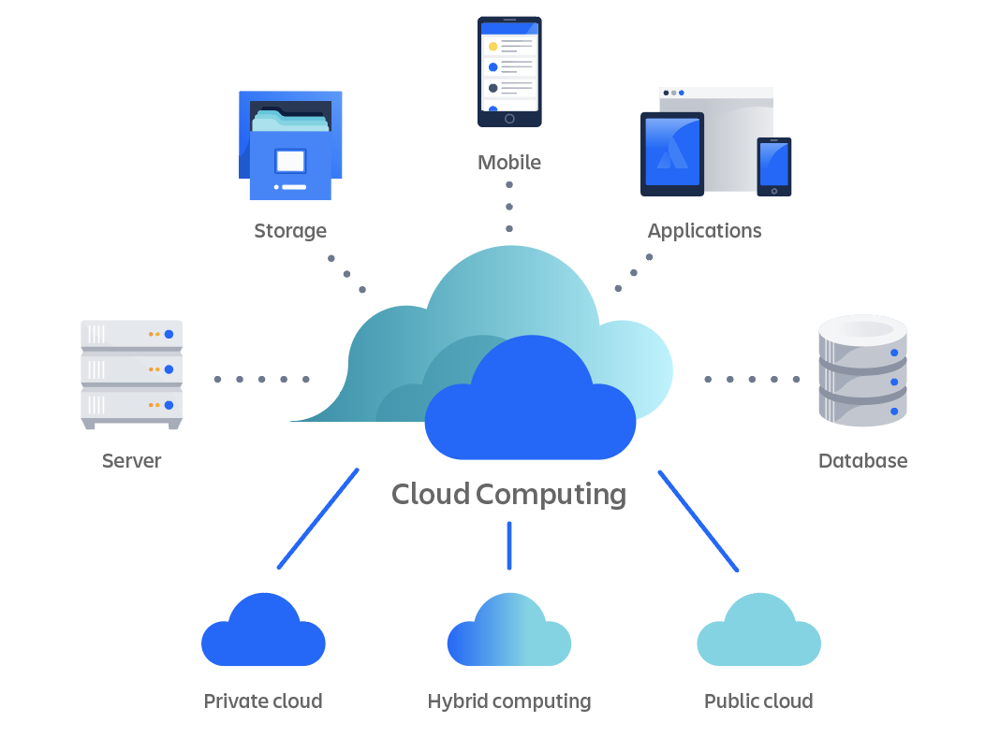
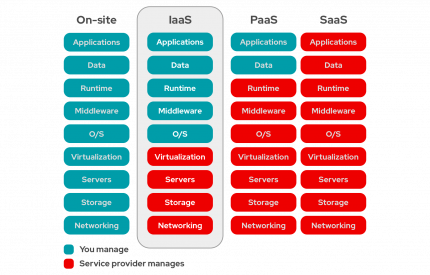
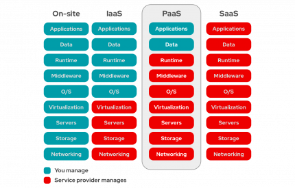
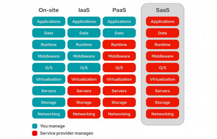
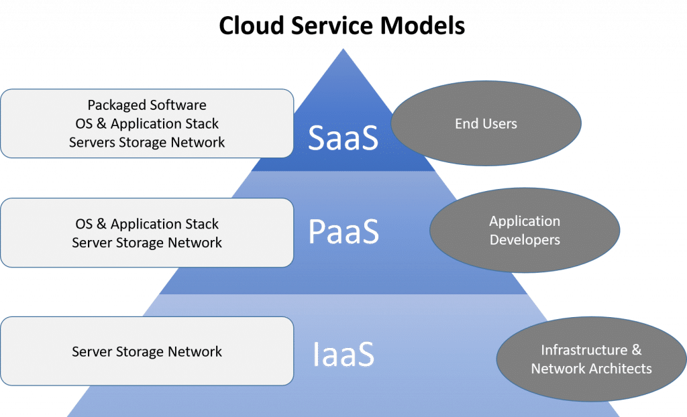
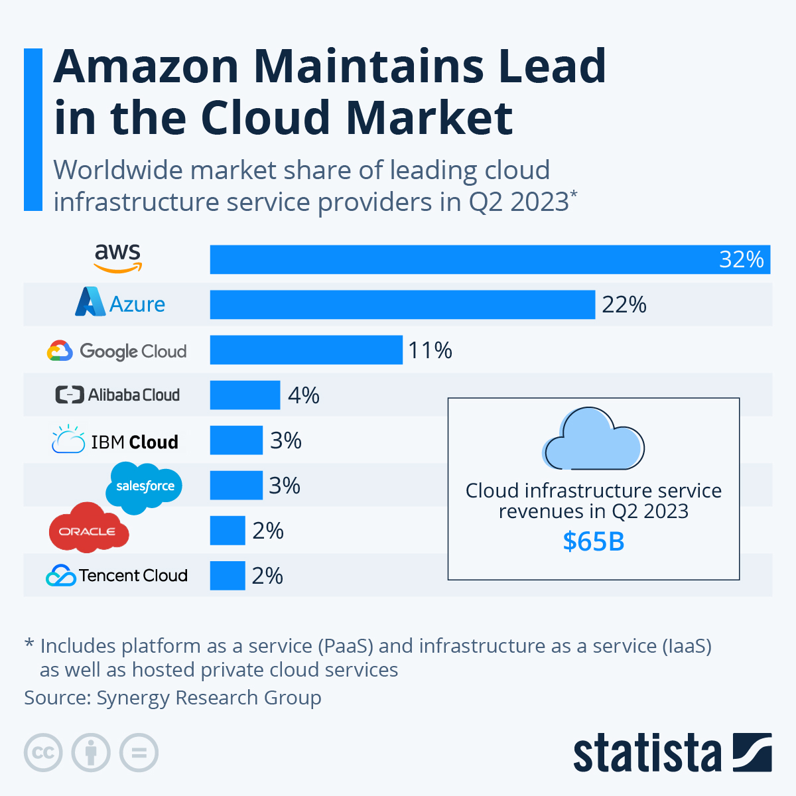

# What is Cloud?

- What is Cloud Computing? 
  -

1. On-demand delivery of IT resources over the internet.
2. Variable, elastic, traffic-oriented pricing.
3. Offers subscription-based services.
4. Opposes buying, owning, and maintaining physical data centers and servers.

(Source - Atlassian)

- Quick history/timeline of Cloud Computing.
  - 

### 1960s - 70s
1. Time-sharing began, allowing computing resources to be used among many tasks or users.
2. Allowed for multitasking by a single user or enables multiple user sessions.

### Late 80s - 90s
1. Internet created in late 80's.
2. Telecommunication businesses explored ways to make time-sharing available to more people.
3. Software as a Service (subscription-based software delivery and licensing) was created.

### 2000s
1. 2002: Amazon creates Amazon Web Services - allows developers to build applications independently.
2. 2006: Amazon creates Simple Storage Service (S3) and Elastic Compute Cloud (EC2).
   1. S3 and EC2 and the first server visualizations to provide Infrastructure as a Service on a pay-as-you-go basis.
3. Netflix launches, the first Streaming as a Service site.

### 2010s
1. Microsoft Azure launches - competition to Amazon.
2. IBM, Oracle, Google all release various cloud applications.
3. Amazon continues to expand and extend cloud applications and ability.

### 2020s
1. COVID pandemic causes cloud technology to surge in popularity due to distancing.
2. Security, flexibility, on-demand means users can get what they want, when they want, on an elastic scale.

- What can you do with Cloud Computing?
  - 

1. Scalable Computing Resources
2. Web Hosting and Developing
3. Data Storage
4. Serverless Computing

- What is “On-Prem”?
  - 

1. On-Premises (On-Prem) is a method of deploying software,
2. Opposite form of software delivery to Cloud.
3. Not available on the web, can only be provided physically or through local server.
4. Disallows third party access.
5. Allows for physical control over software.
6. No paying third-party fees / monthly / on-demand subscription.

- What are the 4 TYPES of Cloud?
  - 

1. Public Clouds
    1. Cloud environment created from IT infrastructure not owned by the end user.
2. Private Clouds
    1. Solely dedicated to a single end user group, where the environment runs behind that user or group's firewall.
3. Hybrid Clouds
    1. A seemingly single IT environment created from multiple environments connected through local area networks (LAN's).
4. Multi-clouds
    1. More than one cloud service, from more than one cloud vendor - public or private.

- What are the different types of cloud SERVICE?
  - 

1. Infrastructure as a Service (IaaS)
   1. This means that the infrastructure is managed by the cloud provider.
   2. Virtualization, servers, storage, networking are all provided and manager by the server provider.

(Source - Red Hat)
2. Platform as a Service (PaaS)
   1. This means that the hardware and application-software are provided by a service provider.
   2. The user handles the applications that run on top of this platform.

(Source - Red Hat)
3. Software as a Service (SaaS)
    1. Everything down to the current software being ran by the user is provided by the cloud service provider.

(Source - Red Hat)

(Source - Uniprint)

- Advantages/Disadvantages of the Cloud?
  - 

1. Agility:
   1. Easy to move between technologies.
   2. Change resources quickly.
   3. Expandable services, large range of applications available.
2. Elasticity:
   1. Don't have to buy bulk "just in case" demand increases.
   2. Automatically scale services to fit incoming traffic, and scale down at lower demand times.
   3. Capacity fits the business, not the other way round.
3. Cost-savings:
   1. No need to pay fixed expenses on data centres.
   2. Don't need to over pay to allow high-demand at all times.
   3. Only have to pay for higher traffic usage at the time of higher traffic use.
4. Deploy anywhere, anytime:
   1. Move servers anywhere regionally to allow for closer proximity to clients.
   2. Move / set up at any time, anywhere.

- What is OpEx vs CapEx?
  - 

1. Operating Expenses
    1. Day-to-Day, ongoing expenses required to keep a business operational.
2. Capital Expenditures
    1. Long-term investments in long-term assets and projects that are expected to generate value over extended period of time.

- Market share - What is the breakdown?
  - 

(Source - Statista)

- What are the 3 largest Cloud providers know for (What makes them popular?)
  - 

1. Amazon AWS:
   1. S3
   2. EC2
   3. CloudWatch
2. Microsoft Azure:
   1. Azure DevOps
   2. VM's
   3. Blob Storage
3. Google Cloud Platform (GCP):
   1. Cloud Computing
   2. Cloud Storage
   3. Kubernetes

- Pillars of DevOps:
  - 
